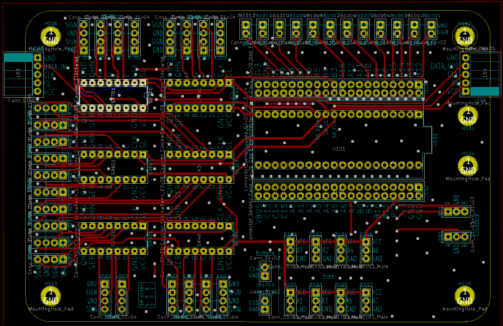
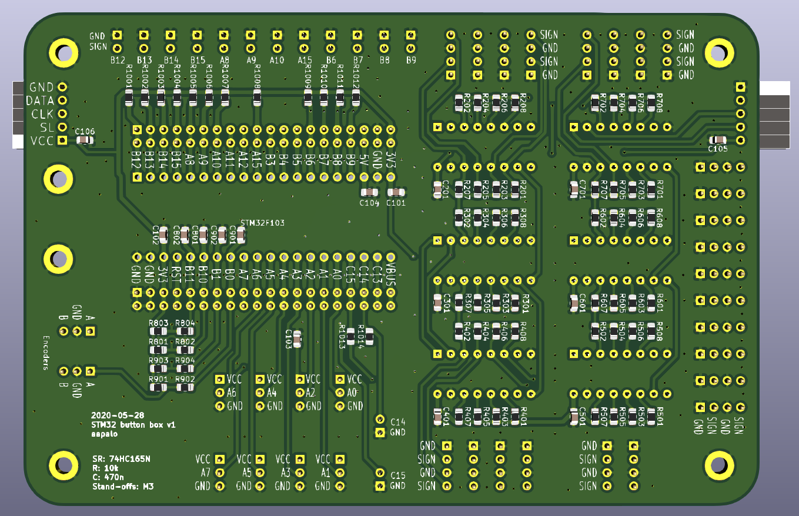
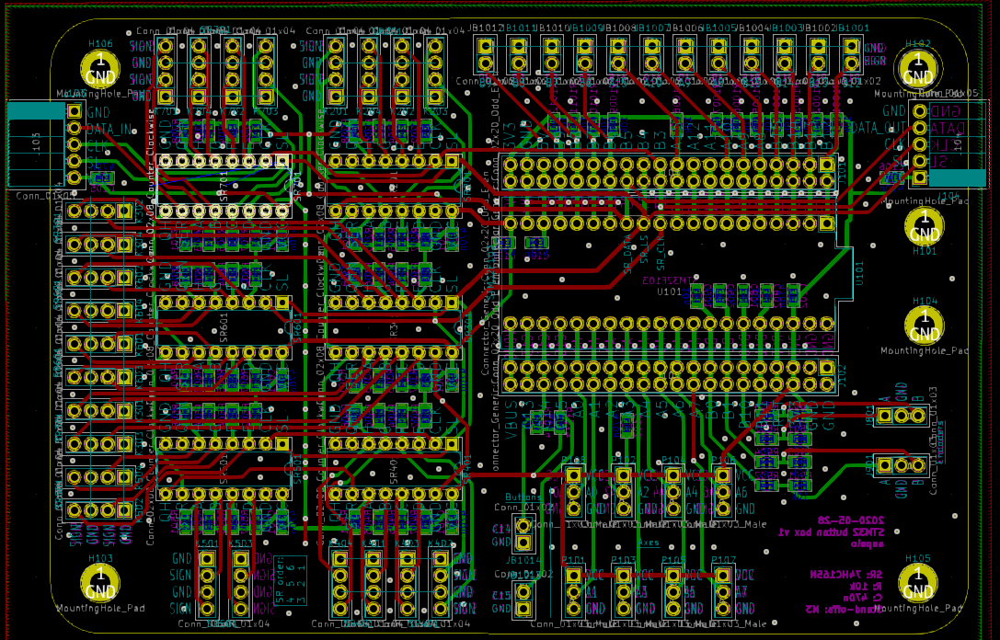

# Freejoy input board

Features:
- Inputs for eg two encoders, eight axes and six shift registers
- Several boards can be daisy-chained via the 1x5 pin socket J103.
- Meant to be used with the Freejoy software: <https://github.com/FreeJoy-Team/FreeJoy>
----

The required components include:
- STM32F103 "Blue Pill"
- Shift register, 74HC165N, DIP-16
- SMD resistors, 10k Ohm, 0805
- SMD capacitors, 470nF, 0805
- Pin sockets and/or headers, 2.54mm pitch
- Buttons/switches
- Jumper wires for the buttons/switches

----

[//]: # (Todo: add pictures of a soldered version)

The schematic (see also pics/schema.pdf):

Top side, with the 3d view and layout view:

Bottom side, with the 3d view and layout view:

Both the top and bottom layer visible:

